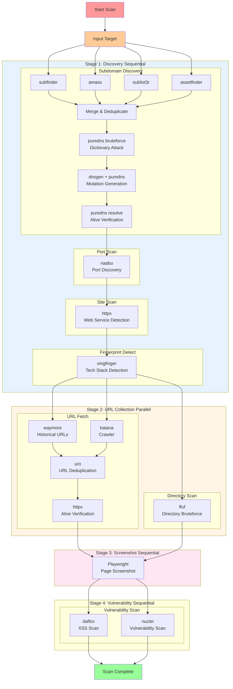

# 扫描流程架构

## 完整扫描流程



## 执行阶段定义

```python
# backend/apps/scan/configs/command_templates.py
# Stage 1: 资产发现 - 子域名 → 端口 → 站点探测 → 指纹识别
# Stage 2: URL 收集 - URL 获取 + 目录扫描（并行）
# Stage 3: 截图 - 在 URL 收集完成后执行，捕获更多发现的页面
# Stage 4: 漏洞扫描 - 最后执行
EXECUTION_STAGES = [
    {'mode': 'sequential', 'flows': ['subdomain_discovery', 'port_scan', 'site_scan', 'fingerprint_detect']},
    {'mode': 'parallel', 'flows': ['url_fetch', 'directory_scan']},
    {'mode': 'sequential', 'flows': ['screenshot']},
    {'mode': 'sequential', 'flows': ['vuln_scan']},
]
```

## 各阶段输出

| Flow | 工具 | 输出表 |
|------|------|--------|
| subdomain_discovery | subfinder, amass, sublist3r, assetfinder, puredns | Subdomain |
| port_scan | naabu | HostPortMapping |
| site_scan | httpx | WebSite |
| fingerprint_detect | xingfinger | WebSite.tech（更新） |
| url_fetch | waymore, katana, uro, httpx | Endpoint |
| directory_scan | ffuf | Directory |
| screenshot | Playwright | Screenshot |
| vuln_scan | dalfox, nuclei | Vulnerability |
